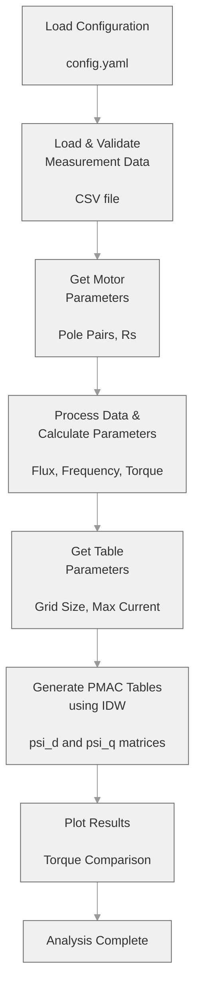
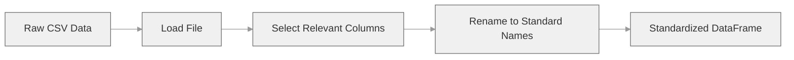
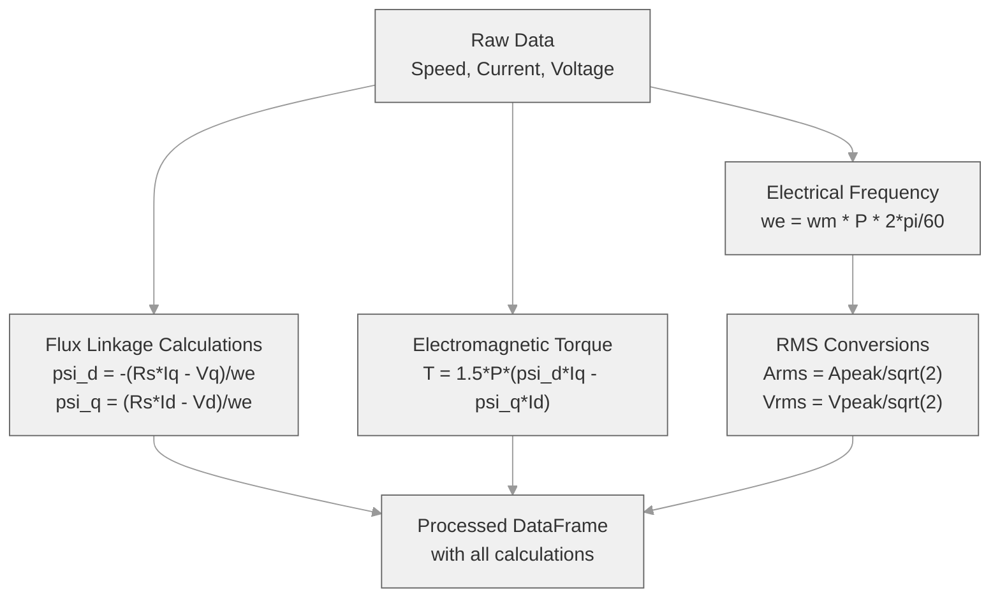

# TableGen - PMAC Lookup Table Generation Tool

A comprehensive tool for generating flux linkage lookup tables for Permanent Magnet AC (PMAC) motors using measured motor data and inverse distance weighting (IDW) interpolation.

## Overview

This tool orchestrates a complete motor analysis workflow that processes raw measurement data and generates 2D PMAC lookup tables (psi_d and psi_q) indexed by direct-axis (Id) and quadrature-axis (Iq) currents. These tables are essential for model-based motor control and simulation applications.

### Process Workflow



## Configuration

A YAML configuration file is provided at `config/config.yaml`. Although sensible defaults are included, you may customize:

- **Column name mappings**: Map your CSV headers to standard names
- **Default parameter values**: Motor parameters, table grid size, maximum current
- **Validation rules**: Min/max constraints for user inputs

Example configuration structure:
```yaml
data:
  columnNames:
    time: "Time"
    speedMeasured: "Speed"
    torqueMeasured: "Torque"
  standardNames:
    time: "timeS"
    speedMeasured: "speedRpm"
    torqueMeasured: "torqueMeasuredNm"

motor:
  defaults:
    polePairs: 4
    statorResistance: 0.1
```

## Inputs

### Motor Parameters (User Prompted)

- **Pole Pairs**: Number of pole pairs in the motor (typically 2-8)
- **Stator Resistance (Rs)**: Stator winding resistance in Ohms

### Measurement Data (CSV File)

Required columns in the input CSV:
- Time measurements
- Speed (RPM)
- Torque (Nm)
- Direct-axis current (Id, Amps)
- Quadrature-axis current (Iq, Amps)
- Direct-axis voltage (Vd, Volts)
- Quadrature-axis voltage (Vq, Volts)

### Table Generation Parameters (User Prompted)

- **Grid Size**: Resolution of lookup tables (e.g., 21 = 21x21 matrix)
- **Maximum Current**: Current range for table generation (Amps)

## Processing Steps

### Step 1: Data Loading & Validation



Raw measurement data is loaded from CSV and standardized using column mappings from the configuration.

### Step 2: Motor Parameter Input

User is prompted to enter motor-specific parameters with configurable defaults shown from the YAML configuration.

### Step 3: Data Processing & Parameter Calculation



Additional electrical parameters are calculated:
- **Electrical Frequency**: From mechanical speed and pole pairs
- **Flux Linkages**: Using dq-reference frame voltage equations
- **Electromagnetic Torque**: From flux linkages and currents
- **RMS Values**: Converted from peak measurement values

### Step 4: PMAC Table Generation

A 2D lookup table is generated with:
- **X-axis**: Direct-axis current (Id) from 0 to max current
- **Y-axis**: Quadrature-axis current (Iq) from 0 to max current
- **Values**: Interpolated flux linkage (λd and λq) at each current point

**Interpolation Method**: Inverse Distance Weighting (IDW)
- Points within the distance threshold are weighted inversely by distance
- If no points exist within threshold, the nearest point is used
- Provides smooth, physically reasonable flux linkage curves

### Step 5: Results Visualization

Plots are generated comparing:
- Electromagnetic torque (calculated)
- Measured torque (from raw data)

This validates the accuracy of the calculated electrical parameters.

## Installation & Usage

### Prerequisites

- Python 3.9 or later
- UV package manager (recommended) or pip

### Setup

```bash
# Clone or navigate to project directory
cd tableGen

# Install dependencies
uv sync

# Run the tool
uv run python tableGen.py
```

### Running the Tool

1. The tool will prompt for configuration options
2. Provide the path to your measurement CSV file (default: `sample_data/sample.csv`)
3. Enter motor parameters when prompted
4. Specify table generation parameters
5. Review the plotted comparison results

## Project Structure

```
tableGen/
├── tableGen.py                 # Main entry point
├── config/
│   └── config.yaml            # Configuration file
├── sample_data/
│   └── sample.csv             # Example measurement data
├── src/
│   ├── config_loader.py       # Configuration loading
│   ├── data_loader.py         # CSV data loading
│   ├── data_processor.py      # Data processing & calculations
│   ├── motor_parameters.py    # Motor parameter input
│   ├── table_parameters.py    # Table generation parameter input
│   ├── table_generator.py     # PMAC table generation via IDW
│   ├── plotting.py            # Result visualization
│   └── lib/
│       ├── calculations/      # Electrical calculations
│       │   ├── flux.py
│       │   ├── frequency.py
│       │   ├── torque.py
│       │   ├── power.py
│       │   └── transformations.py
│       └── conversions/       # Unit conversions
│           ├── speed.py
│           └── waveform.py
├── docs/
│   ├── README.md              # This file
│   └── GUIDELINES.md          # Development guidelines
└── tests/                     # Test suite

```

## Mathematical Background

### Flux Linkage Calculation (dq-reference frame)

The flux linkage is calculated from the dq-voltage equation:

```
lambda_d = -(Rs * Iq - Vq) / we
lambda_q = (Rs * Id - Vd) / we
```

Where:
- lambda_d, lambda_q = Direct and quadrature flux linkages (Wb-turns)
- Rs = Stator resistance (Ohms)
- Id, Iq = Direct and quadrature currents (A)
- Vd, Vq = Direct and quadrature voltages (V)
- we = Electrical frequency (rad/s)

### Electromagnetic Torque

```
Te = 1.5 * P * (lambda_d * Iq - lambda_q * Id)
```

Where:
- Te = Electromagnetic torque (Nm)
- P = Number of pole pairs
- Id, Iq = Direct and quadrature currents (A)

### Inverse Distance Weighting Interpolation

For each target point (Id, Iq), nearby measured points are weighted by:

```
Weight_i = 1 / d_i

Value = SUM(Weight_i * Value_i) / SUM(Weight_i)
```

Where d_i is the Euclidean distance from the target point to measured point i.

## License

[Specify your license here]

## Contributing

[Specify contribution guidelines here]