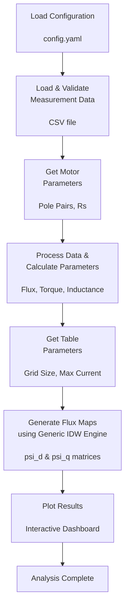
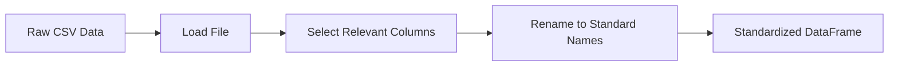
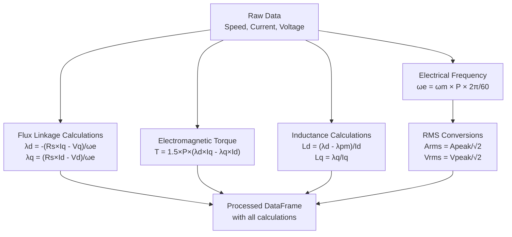

# TableGen - PMAC Lookup Table Generation Tool

A comprehensive tool for generating flux linkage lookup tables (flux maps) for 
synchronous motors using measured motor data and generic inverse distance 
weighting (IDW) interpolation.

## Overview

This tool orchestrates a complete motor analysis workflow that processes raw 
measurement data and generates 2D flux linkage maps (psi_d and psi_q) indexed 
by direct-axis (Id) and quadrature-axis (Iq) currents. These tables are 
essential for model-based motor control and simulation applications.

### Process Workflow



## Configuration

A YAML configuration file is provided at `config/config.yaml`. Although sensible defaults are included, you may customize:

- **Column name mappings**: Map your CSV headers to standard names (e.g., `TimeStamp` → `time_s`)
- **Default parameter values**: Motor parameters (`pole_pairs`, `rs_ohm`), table grid size (`size`), maximum current (`max_current_a`)

Example configuration structure:
```yaml
motor:
  pole_pairs: 6
  rs_ohm: 0.068

data:
  column_names:
    time: "TimeStamp"
    torque_measured: "Torque"
    speed_rpm: "Speed"
  standard_names:
    input:
      time: "time_s"
      torque_measured: "torque_measured_nm"
      speed_rpm: "speed_rpm"
```

## Inputs

### Motor Parameters (User Prompted)

- **Pole Pairs**: Number of pole pairs in the motor (typically 2-8, `pole_pairs`)
- **Stator Resistance (Rs)**: Stator winding resistance in Ohms (`rs_ohm`)

### Measurement Data (CSV File)

Required columns in the input CSV:
- Time measurements
- Speed (RPM)
- Torque (Nm)
- Direct-axis current (Id, Amps)
- Quadrature-axis current (Iq, Amps)
- Direct-axis voltage (Vd, Volts)
- Quadrature-axis voltage (Vq, Volts)

### Table Generation Parameters (User Prompted)

- **Grid Size**: Resolution of lookup tables (e.g., 21 = 21x21 matrix, `size`)
- **Maximum Current**: Current range for table generation (Amps, `max_current_a`)

## Processing Steps

### Step 1: Data Loading & Validation



Raw measurement data is loaded from CSV and standardized using column mappings from the configuration.

### Step 2: Motor Parameter Input

User is prompted to enter motor-specific parameters with configurable defaults shown from the YAML configuration.

### Step 3: Data Processing & Parameter Calculation



Additional electrical parameters are calculated:
- **Electrical Frequency**: From mechanical speed and pole pairs
- **Flux Linkages**: Using dq-reference frame voltage equations
- **Electromagnetic Torque**: From flux linkages and currents
- **Inductances**: D-axis (Ld) and Q-axis (Lq) inductances
- **RMS Values**: Converted from peak measurement values

### Step 4: Flux Map Generation

A 2D lookup table is generated with:
- **X-axis**: Direct-axis current (Id) from 0 to max current
- **Y-axis**: Quadrature-axis current (Iq) from 0 to max current
- **Values**: Interpolated flux linkage (λd and λq) at each current point

**Interpolation Method**: Inverse Distance Weighting (IDW)
- Points within the distance threshold are weighted inversely by distance
- If no points exist within threshold, the nearest point is used
- Provides smooth, physically reasonable flux linkage curves

### Step 5: Results Visualization (Interactive Dashboard)
 
An interactive Plotly dashboard is displayed (single browser window) containing:
- **Torque Comparison**: Electromagnetic vs Measured torque (Unified Hover)
- **Flux D-Axis Surface**: 3D Surface map with projected contours (Viridis)
- **Flux Q-Axis Surface**: 3D Surface map with projected contours (Viridis)
- **Inductance D-Axis Surface**: 3D Surface map for Ld (Viridis)
- **Inductance Q-Axis Surface**: 3D Surface map for Lq (Viridis)
 
This validates the accuracy of the calculated electrical parameters and visualizes the flux linkage maps.

## Installation & Usage

### Prerequisites

- Python 3.9 or later
- UV package manager (recommended) or pip

### Setup

```bash
# Clone or navigate to project directory
cd tableGen

# Install dependencies
uv sync

# Run the tool
uv run python tableGen.py
```

### Running the Tool

1. The tool will prompt for configuration options
2. Provide the path to your measurement CSV file (default: `sample_data/sample.csv`)
3. Enter motor parameters when prompted
4. Specify table generation parameters
5. Review the plotted comparison results

## Project Structure

```
tableGen/
├── tableGen.py                 # Main entry point
├── config/
│   └── config.yaml            # Configuration file
├── sample_data/
│   └── sample.csv             # Example measurement data
├── src/
│   ├── config_loader.py       # Configuration loading
│   ├── data_loader.py         # CSV data loading
│   ├── data_processor.py      # Data processing & calculations
│   ├── motor_parameters.py    # Motor parameter input
│   ├── table_parameters.py    # Table generation parameter input
│   ├── table_generator.py     # Flux map coordination
│   ├── lib/                   # Refactored calculation library
│   │   ├── calculations/      # Core electrical math
│   │   │   ├── flux.py
│   │   │   ├── frequency.py
│   │   │   ├── inductance.py
│   │   │   ├── torque.py
│   │   │   ├── power.py
│   │   │   └── transformations.py
│   │   ├── conversions/       # Unit conversions
│   │   │   ├── speed.py
│   │   │   └── waveform.py
│   │   └── utils/             # Implementation utilities
│   │       ├── interpolation.py
│   │       └── table_generation.py
│   ├── plots/                 # Trace generation logic
│   │   ├── torque.py
│   │   ├── flux.py
│   │   └── inductance.py
│   └── ui/                    # Dashboard UI
│       └── dashboard.py
├── docs/
│   ├── README.md              # This file
│   └── GUIDELINES.md          # Development guidelines
└── tests/                     # Test suite

```

## Mathematical Background

### Flux Linkage Calculation (dq-reference frame)

The flux linkage is calculated from the dq-voltage equation:

$$\lambda_d = -\frac{R_s \times I_q - V_q}{\omega_e}$$

$$\lambda_q = \frac{R_s \times I_d - V_d}{\omega_e}$$

Where:
- $\lambda_d$, $\lambda_q$ = Direct and quadrature flux linkages (Wb-turns)
- $R_s$ = Stator resistance (Ω)
- $I_d$, $I_q$ = Direct and quadrature currents (A)
- $V_d$, $V_q$ = Direct and quadrature voltages (V)
- $\omega_e$ = Electrical frequency (rad/s)

### Electromagnetic Torque

$$T_e = \frac{3}{2} \times P \times (\lambda_d \times I_q - \lambda_q \times I_d)$$

Where:
- $T_e$ = Electromagnetic torque (Nm)
- $P$ = Number of pole pairs
- $I_d$, $I_q$ = Direct and quadrature currents (A)

### Inductance Calculation

$$L_d = \frac{\lambda_d - \lambda_{pm}}{I_d}$$

$$L_q = \frac{\lambda_q}{I_q}$$

Where:
- $L_d$, $L_q$ = Direct and quadrature inductances (H)
- $\lambda_{pm}$ = Permanent magnet flux linkage (Wb-turns)

### Inverse Distance Weighting Interpolation

For each target point $(I_d, I_q)$, nearby measured points are weighted by:

$$\text{Weight}_i = \frac{1}{d_i}$$

$$\text{Value} = \frac{\sum (\text{Weight}_i \times \text{Value}_i)}{\sum \text{Weight}_i}$$

Where $d_i$ is the Euclidean distance from the target point to measured point $i$.

## Licence

[Specify your licence here]

## Contributing

[Specify contribution guidelines here]